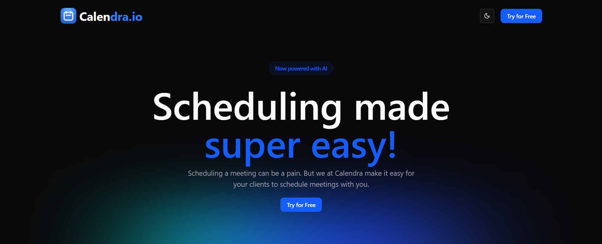

# Calendra.io: AI Powered Calendar Scheduling Platform



## 🌟 Overview

Calendra.io is an open-source, modern scheduling solution designed to simplify the process of managing appointments, meetings, and events with cross platform calendar sync. Built with a powerful tech stack and seamless integration capabilities, this platform provides a robust alternative to proprietary scheduling tools.

## ✨ Features

- **Smart Scheduling**: AI-powered scheduling suggestions based on user availability patterns
- **Multi-provider Authentication**: Secure sign-in with GitHub, Google, and more
- **Calendar Synchronization**: Seamless integration with popular calendar services
- **Email Notifications**: Automated reminders and updates via Nylas API
- **Customizable Meeting Types**: Create various meeting formats with different durations and settings
- **Time Zone Intelligence**: Automatic time zone detection and conversion
- **Responsive Design**: Beautiful UI that works across all devices
- **Team Scheduling**: Coordinate availability across team members
- **Booking Pages**: Personalized scheduling links for individuals and teams

## 🚀 Tech Stack

- **Frontend**: Next.js, React, TypeScript
- **Styling**: Tailwind CSS, Shadcn UI
- **Backend**: Next.js API Routes
- **Database**: PostgreSQL (Supabase)
- **Authentication**: NextAuth.js
- **Email Integration**: Nylas API
- **File Uploads**: UploadThing
- **Deployment**: Vercel

## 📋 Requirements

- Node.js 18.x or higher
- PostgreSQL database (we recommend Supabase)
- Nylas API credentials for email integration
- GitHub & Google OAuth credentials (for authentication)
- UploadThing account for file upload functionality

## 🛠️ Installation

1. **Clone the repository**

```bash
git clone https://github.com/Rio-awsm/calendly-scheduler-platform.git
cd calendly-scheduler-platform
```

2. **Install dependencies**

```bash
npm install
# or
yarn install
# or
pnpm install
# or
bun install
```

3. **Set up environment variables**

Copy the `env.example` file to `.env.local` and fill in your credentials:

```bash
cp env.example .env.local
```

Required environment variables:
- `AUTH_SECRET`: A secure string for NextAuth.js
- `AUTH_GITHUB_ID` & `AUTH_GITHUB_SECRET`: GitHub OAuth credentials
- `AUTH_GOOGLE_ID` & `AUTH_GOOGLE_SECRET`: Google OAuth credentials
- `DATABASE_URL`: Your Supabase PostgreSQL connection string
- `DIRECT_URL`: Direct PostgreSQL connection URL
- `NYLAS_API_SECRET_KEY`, `NYLAS_API_URL`, & `NYLAS_CLIENT_ID`: Nylas API credentials
- `NEXT_PUBLIC_URL`: Your application's public URL
- `UPLOADTHING_TOKEN`: UploadThing authentication token

4. **Set up the database**

```bash
npx prisma db push
# or
yarn prisma db push
```

5. **Run the development server**

```bash
npm run dev
# or
yarn dev
# or
pnpm dev
# or
bun dev
```

6. **Open your browser**

Navigate to [http://localhost:3000](http://localhost:3000) to see the application running.

## 🔄 Usage

After setup, you can:

- Create an account or sign in with GitHub/Google
- Set your availability preferences
- Create custom meeting types
- Share your booking link with others
- Manage your schedule and appointments

## 📚 Documentation

For more detailed documentation, check the `docs` directory or visit our [documentation site](https://github.com/Rio-awsm/calendly-scheduler-platform/wiki).

## 🤝 Contributing

We welcome contributions! Please follow these steps:

1. Fork the repository
2. Create a feature branch: `git checkout -b feature/amazing-feature`
3. Commit your changes: `git commit -m 'Add some amazing feature'`
4. Push to the branch: `git push origin feature/amazing-feature`
5. Open a pull request

Please read our [CONTRIBUTING.md](CONTRIBUTING.md) for details on our code of conduct and the process for submitting pull requests.

## 📄 License

This project is licensed under the MIT License - see the [LICENSE](LICENSE) file for details.

## 🙏 Acknowledgements

- [Next.js](https://nextjs.org/) for the incredible framework
- [Shadcn UI](https://ui.shadcn.com/) for awesome UI components
- [Supabase](https://supabase.io/) for database services
- [Nylas](https://www.nylas.com/) for email integration
- [NextAuth.js](https://next-auth.js.org/) for authentication
- [UploadThing](https://uploadthing.com/) for file upload capabilities
- [Vercel](https://vercel.com/) for hosting and deployment

## 📞 Support

For support, please open an issue on the repository or contact the maintainers at [mm.saha1982@gmail.com](mailto:mm.saha1982@gmail.com).

---

Made with ❤️ by [Rio-awsm](https://github.com/Rio-awsm)